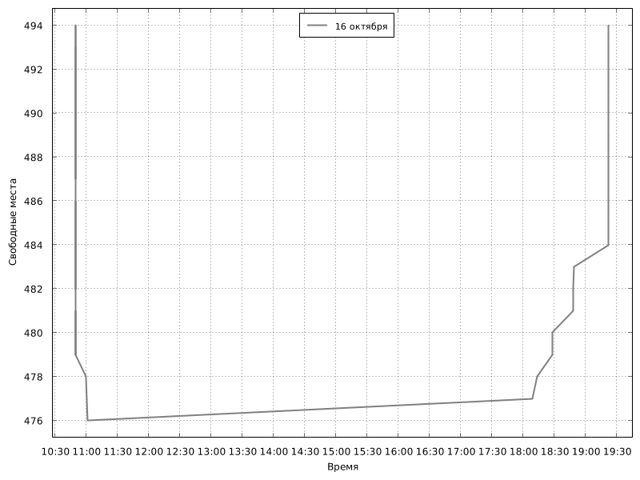

# Mail.ru Park Api

Api for [p.corp.mail.ru](http://p.corp.mail.ru/)

## Methods

- `GET /` - Return plaintext. Available parking spaces.

Example response: 
```
500
```

- `GET /plots/` - Return json.

Example response: 
```
{"count":500,"plots":[{"label":"сегодня","color":"black","data":[]},{"label":"16 октября","color":"gray","data":[[1603048953000,494],[1603048953000,493],[1603048953000,492],[1603048953000,491],[1603048953000,490],[1603048952000,489],[1603048952000,488],[1603048952000,487],[1603048952000,486],[1603048951000,485],[1603048951000,484],[1603046972000,483],[1603046932000,482],[1603046932000,481],[1603045708000,480],[1603045707000,479],[1603044827000,478],[1603044564000,477],[1603018936000,476],[1603018823000,478],[1603018219000,479],[1603018218000,480],[1603018218000,479],[1603018217000,481],[1603018217000,480],[1603018216000,482],[1603018215000,483],[1603018215000,482],[1603018214000,484],[1603018214000,483],[1603018213000,485],[1603018213000,484],[1603018212000,486],[1603018212000,485],[1603018211000,487],[1603018210000,488],[1603018210000,487],[1603018209000,489],[1603018209000,488],[1603018208000,490],[1603018208000,489],[1603018207000,491],[1603018207000,490],[1603018206000,492],[1603018206000,491],[1603018205000,493],[1603018205000,492],[1603018204000,494],[1603018204000,493]]}]}
```

- `GET /image/` - Return image. 

Example response:



## How set up

### From Docker Hub


### From source
1. Install docker and docker-compose
2. Run `docker-compose up`
